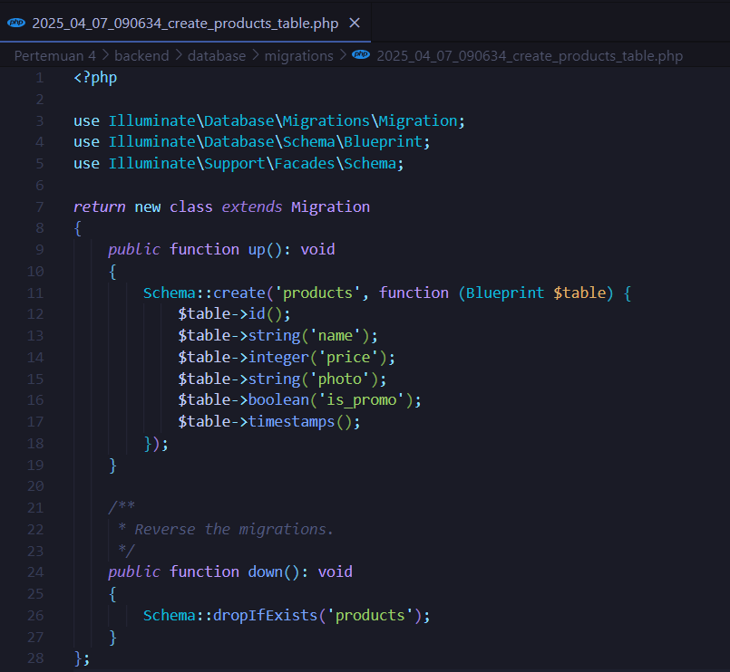

# TUGAS 2 - 22100035

### Migration
 
Hal pertama yang dilakukan adalah membuat file migration. File migration ini digunakan untuk mendefinisikan struktur tabel di dalam sebuah database.
Kolom pertama adalah **id**, id ini berperan sebagai *Primary Key*. Kolom selanjutnya adalah **name** dengan tipe data *String*. Dilanjutkan dengan kolom **price** dengan tipe data *Integer*, kolom **photo** dengan tipe data *String* supaya bisa menyimpan url gambar jika ingin mengambil data secara online, kolom **is_promo** dengan tipe data *boolean* sebagai penanda apakah produk ini sedang promo.

### Model
 
Langkah selanjutnya adalah membuat file model **Product** sebagai wakil untuk tabel Product. Masukkan semua kolom ke dalam *fillable* supaya nantinya bisa diisi data.

### Controller
Selanjutnya, isi *Controller* dengan method-method *RESTful API*.
**1. index()** 
 
Dengan method ini kita akan mengambil dan menampilkan semua kolom yang ada di database. Untuk index() kita menggunakan metode GET.

**2. show()** 
 
Method show() ini kita gunakan untuk mengambil satu produk berdasarkan id. Untuk show() kita menggunakan metode GET.

**3. store()** 
 
Method store() ini berguna untuk menambahkan produk baru ke dalam database. Sebelum menambahkan data, akan dilakukan validasi terhadap data terlebih dahulu menggunakan validate. Jika semua data adalah valid, maka data akan ditambahkan. Ketika data berhasil ditambahkan, maka akan mengembalikan pesan berupa JSON yang berisi *Produk berhasil ditambahkan*, dan jika gagal maka tetap akan mengirim pesan *Produk gagal ditambahkan*. Untuk store() kita menggunakan metode POST.

**4. update()** 
 
Method store() ini berguna untuk memperbarui data produk. Pertama kita akan membuat variabel $product yang berisi id dari produk yang ingin kita ubah. Jika id tidak ditemukan maka akan mengembalikan pesan berupa JSON yang isinya adalah *Produk tidak ditemukan*. Jika id ditemukan maka akan lanjut ke proses validasi. Validasi akan dilakukan hanya jika data dikirim (sometimes). Setelah itu, data diupdate menggunakan method update(). Ketika data berhasil diupdate, maka akan dikembalikan pesan *Produk berhasil diupdate*. Untuk update() kita menggunakan metode PUT.

**5. destroy()** 
 
Sama seperti ketika kita melakukan update, pertama-tama kita ambil dulu id dari produk yang ingin kita hapus. Jika id tidak ditemukan, maka akan mengembalikan pesan *Produk tidak ditemukan*. Jika id ditemukan, maka akan menjalankan delete() untuk menghapus data. Ketika data berhasil di hapus, maka akan mengembalikan pesan *Produk berhasil dihapus*. Untuk destroy() kita menggunakan metode DELETE.

### Route
 
Terakhir, tambahkan route di bagian api.php

### Pengujian di Postman
1. Pengujian method index()

1. Pengujian method show()

1. Pengujian method store()

1. Pengujian method update()

1. Pengujian method destroy()

